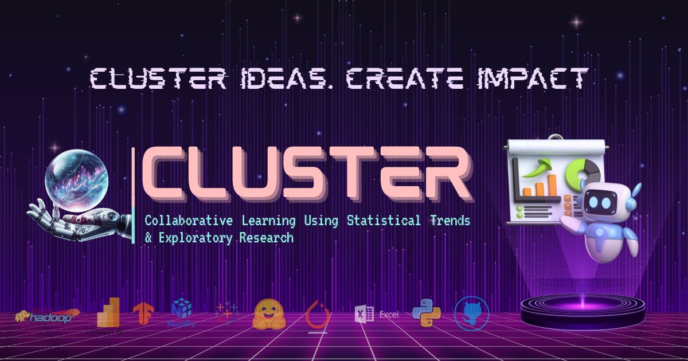
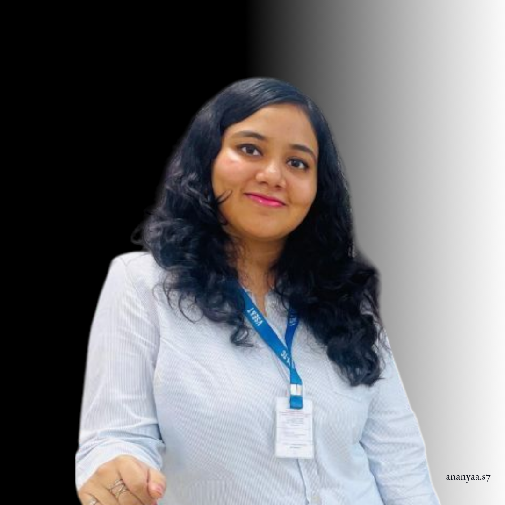
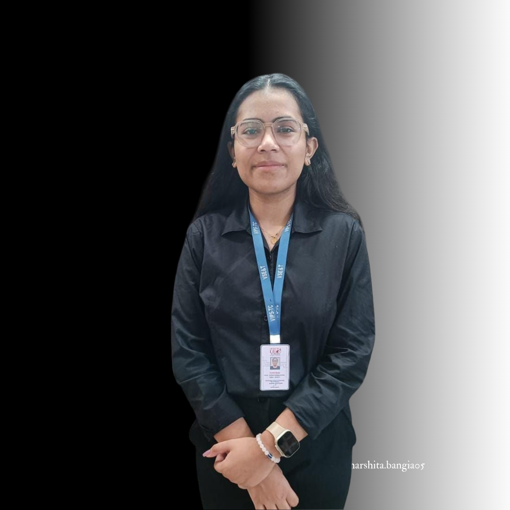

  

<h1 align="center">🚀 Welcome to CLUSTER 🚀</h1>
<h3 align="center"><i>Collaborative Learning Using Statistical Trends & Exploratory Research</i></h3>

  <b>The Data Science Revolution Has Begun.</b> 
  ⚡ Electrifying collaboration. 🔍 Explosive exploration. 🤝 Fearless innovation.

  
  
  
  
  

---

## 🌌 What is CLUSTER?

**CLUSTER** is not just a data science club.  
It's a **movement**—a galaxy where **statistics meets storytelling**, **models meet madness**, and **code meets creativity**.  
We don't follow the data—we **launch into it**.

---

## 🌟 Core Pillars

| 💠 Pillar           | 🔥 Description                                                                      |
|---------------------|-------------------------------------------------------------------------------------|
| 🤝 Collaboration     | Hackathons, challenges, and collective brainwaves—because **data loves company**.   |
| 📊 Data Exploration  | From cleaning to compelling storytelling—we **find gold in the noise**.             |
| 🧠 Learning Labs     | Learn by doing: workshops, demos, and deep-dives with the **best in the biz**.      |
| 🚀 Innovation        | Tools, models, visualizations—you bring the **chaos**, we create **impact**.        |

---

## 💼 Projects & Initiatives

> Where ideas **detonate** into solutions:

- 🔍 **Data Discovery Diaries** – Exploratory adventures through complex datasets  
- 🤖 **ML Missions** – Build and deploy real-world AI models  
- 🌐 **Open-Source Lab** – Create, share, and collaborate  
- 🧩 **Cluster Quests** – Monthly themed data battles with glory & badges 
- 📈 **Viz Vortex** – Data meets design in beautiful dashboards

[🚀 Check out our Repositories »](https://github.com/orgs/CLUSTER-DS-Club/repositories)

---

## 🛠️ Tech Stack

| **Category**               | **Tools**                                                                                                                                       |
|---------------------------|--------------------------------------------------------------------------------------------------------------------------------------------------|
| 🌐 **Core Languages**     | 🐍 📊 💾 ⚡ ⚙️    `Python, R, SQL, Julia, Scala`                                                                                              |
| 📚 **Libraries & ML**     | 📦 🧠 🔍 🚀 🤖 🧬    `pandas, NumPy, scikit-learn, matplotlib, seaborn, Plotly, XGBoost, LightGBM, TensorFlow, PyTorch, Keras`              |
| 📈 **Visualization**      | 📊 📉   `Power BI, Tableau, Looker, Superset, Dash, Bokeh`                                                                                   |
| 🧠 **AI & LLMs**          | 🧠 🗣️ 💬 🦙   `Transformers (HuggingFace), OpenAI, LangChain, LlamaIndex, BERT, GPT, T5, Claude, Cohere, LLaMA`                            |
| ⚙️ **MLOps & Deployment** | 🐳 🚢 ☁️ 🧪 🧰   `Docker, Kubernetes, Flask, FastAPI, Streamlit, Gradio, BentoML, MLflow, DVC, Weights & Biases`                             |
| 🔧 **Engineering & ETL**  | 🔥 💨 🧬 🔁   `Apache Spark, Kafka, Airflow, dbt, Delta Lake, Snowflake, Airbyte, Fivetran`                                                  |
| 💾 **Storage & DBs**      | 🗄️ ☁️ 🧊   `PostgreSQL, MySQL, MongoDB, SQLite, Redis, BigQuery, Redshift`                                                                 |
| ☁️ **Cloud Platforms**    | 🌩️ 🧠 🧮   `AWS (S3, EC2, SageMaker), GCP (BigQuery, Vertex AI), Azure ML, Databricks, Kaggle, Hugging Face, Google Colab`                 |
| 📊 **Tracking & CI/CD**   | 📊 🧪 ⚙️   `MLflow, W&B, GitHub Actions, GitLab CI/CD, Jenkins`                                                                              |
| 🔄 **Data Formats**       | 🧾 📦 📂   `Parquet, Avro, ORC, JSON, YAML, Feather, Protobuf`                                                                               |

---
<!--
## 👩‍🚀 Meet the CLUSTER Crew

> The minds behind the madness.

  🛰️ <strong>Leadership</strong>
  <table>
    <tr>
      <td align="center">
         
        <b>Utsav Singhal</b> 
        President 
        <a href="https://github.com/UTSAVS26">GitHub</a> • 
        <a href="https://www.linkedin.com/in/utsavsinghal2604/">LinkedIn</a>
      </td>
      <td align="center">
         
        <b>Aanchal Mishra</b> 
        Vice President 
        <a href="https://github.com/Aanchal0502">GitHub</a> • 
        <a href="https://www.linkedin.com/in/aanchal-mishra-3a2448287">LinkedIn</a>
      </td>
    </tr>
  </table>

   

  📋 <strong>Operations & Events</strong>
  <table>
    <tr>
      <td align="center">
         
        <b>Ananya Sharma</b> 
        Secretary 
        <a href="https://github.com/Ananyas-7">GitHub</a> • 
        <a href="https://www.linkedin.com/in/ananya-swami-728852273">LinkedIn</a>
      </td>
      <td align="center">
         
        <b>Harshita Bangia</b> 
        Treasurer 
        <a href="https://github.com/harshita310">GitHub</a> • 
        <a href="https://www.linkedin.com/in/harshita-bangia-2aa1ab2b4/">LinkedIn</a>
      </td>
      <td align="center">
         
        <b>Rhythm Arora</b> 
        Event Manager 
        <a href="https://github.com/rhythmarora070">GitHub</a> • 
        <a href="https://www.linkedin.com/in/rhythmaroraa0766/">LinkedIn</a>
      </td>
    </tr>
  </table>

   

  📣 <strong>Media Team</strong>
  <table>
    <tr>
      <td align="center">
         
        <b>Abu Maaz</b> 
        Social Media Coordinator 
        <a href="https://github.com/somewherelostt">GitHub</a> • 
        <a href="https://www.linkedin.com/in/abu-maaz-/">LinkedIn</a>
      </td>
      <td align="center">
         
        <b>Jayati Ahuja</b> 
        Social Media Coordinator 
        <a href="https://github.com/JAYATIAHUJA">GitHub</a> • 
        <a href="https://www.linkedin.com/in/jayati-ahuja-a4b16724a">LinkedIn</a>
      </td>
    </tr>
  </table>

-->
---

## 🛡️ Contribute to CLUSTER

We welcome your magic 🪄

### 🚦 Getting Started
1. Fork the repo
2. Clone your forked repo
3. Create your feature branch (`git checkout -b amazing-feature`)
4. Commit your changes (`git commit -m 'add amazing feature'`)
5. Push to the branch (`git push origin amazing-feature`)
6. Open a Pull Request 🚀

### 💖 What You Can Do
- Improve docs or visuals
- Add new datasets or models
- Submit tools, dashboards, or experiments
- Help triage issues or onboard new members

---

## 📜 Code of Conduct

We are:
- 🌈 Inclusive
- 💬 Open to all ideas
- 🚫 Zero tolerance for hate, toxicity, or harassment

Read our full [Code of Conduct](./CODE_OF_CONDUCT.md) for more.

---

## 🌍 Community Philosophy

> We believe **learning is a journey**, not a lecture.

Whether you're a beginner or a Kaggle Grandmaster, there's space for you in CLUSTER.  
We grow **together**, celebrate each other’s wins, and learn through joyful chaos. ✨

---

## 📫 Let's Connect

- 🌐 Website: [CLUSTER-DS-CLUB](https://cluster-ds-club.github.io/cluster/)
<!-- - 📸 Instagram: [@cluster.vips](https://www.instagram.com/cluster.vips/) -->
- 💼 LinkedIn: [CLUSTER](https://www.linkedin.com/company/cluster-vips/)
- 📧 Email: [dsclub.cluster@vips.edu](mailto:dsclub.cluster@vips.edu)

---

> 🌟 _"Prepare for the unexpected. Embrace the energy. Become part of the legacy."_  
> — The CLUSTER Manifesto

---

  ⭐ Star us • 🍴 Fork us • 📢 Share us • 💥 Join the mission!

